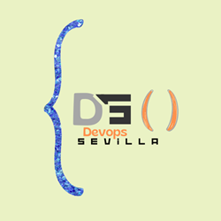

# APP Tutorial List by jmat
 
## In branch Front Vue code and branch Back Java Code
## Project description:
The objective of this project is to develop a tutorial management system in Java and MySQL that allows users to:
- View a list of tutorials
- Add tutorials to the database
- Delete tutorials from the database 
- Edit an existing tutorial 

Project Objectives:
1. Reinforce students' object-oriented programming concepts.
2. Apply inheritance, MVC, Dependency Injection, encapsulation to hide the internal implementation of classes and protect data.
3. Use SOLID principles

## Project Requirements:
1. Programming knowledge in Java, Spring Boot and MySQL.
2. Knowledge in Object Oriented Programming (OOP).
3. Good practices

This template should help get you started developing with Vue 3 in Vite.

## Recommended IDE Setup

[VSCode](https://code.visualstudio.com/) + [Volar](https://marketplace.visualstudio.com/items?itemName=Vue.volar) (and disable Vetur) + [TypeScript Vue Plugin (Volar)](https://marketplace.visualstudio.com/items?itemName=Vue.vscode-typescript-vue-plugin).

## Customize configuration

See [Vite Configuration Reference](https://vitejs.dev/config/).

## Project Setup

```sh
npm install
```

### Compile and Hot-Reload for Development

```sh
npm run dev
```

### Compile and Minify for Production

```sh
npm run build
```

### Run Unit Tests with [Vitest](https://vitest.dev/)

```sh
npm run test:unit
```

# ----------------Español - Enuciado ------------------
## APP Lista de Tutoriales
Diego Cordoba Jofre

Fecha de entrega: 12 jul
Contexto del Proyecto:
Un cliente nos pide una demo de gestión de Tutoriales.
En el futuro este sistema permitirá a los usuarios subir y ver tutoriales parecidos a Udemy, editar un tutorial o eliminarlo.

Marcos de competencias:
-

Descripción del Proyecto:
El objetivo de este proyecto es desarrollar un sistema de gestión de tutoriales en Java y MySQL que permita a los usuarios:
- Ver una lista de tutoriales
- Añadir tutoriales a la base de datos
- Eliminar tutoriales de la base de datos 
- Editar un tutorial existente 

Objetivos del Proyecto:
1. Reforzar los conceptos de programación orientada a objetos de los alumnos.
2. Aplicar herencia, MVC, Inyección de Dependencias, el encapsulamiento  para ocultar la implementación interna de las clases y proteger los datos.
3. Utilizar principios SOLID

Requisitos del Proyecto:
1. Conocimientos de programación en Java, Spring Boot y MySQL.
2. Conocimientos en Programación Orientada a Objetos (POO).
3. Buenas prácticas

Modalidades de evaluación:
Individual, se debe realizar el envió a más tardar el día lunes 12/07. 

Entregables Esperados:
1. Un sistema de gestión de tutoriales implementado en Java  que permita a los usuarios  subir y ver tutoriales, editar un tutorial o eliminarlo (CRUD).
2. Implementación herencia, MVC, Inyección de Dependencias, el encapsulamiento  para ocultar la implementación interna de las clases y proteger los datos.

Recursos Disponibles:
1. Acceso a videos y recursos sobre programación orientada a objetos.
2. Soporte y orientación proporcionados por el equipo formativo.

Cronograma del Proyecto:
- Semana 1: Diseño con las clases y la estructura del sistema de gestión de biblioteca. Implementación de las clases, el encapsulamiento y la herencia. Método Create y Read (de CRUD) funcionando

Criterios de rendimiento:
Diagrama con la explicación del sistema
Repositorio en GitHub con el README correspondiente

Pasos:
En terminal (dentro del proyecto)
- npm install (debemos tener npm instalado en nuestro ordenador)
- npm run dev
- entrar en el localhost con el puerto correspondiente.

GitHub - diegoFactoriaf5/Tutorial-CR